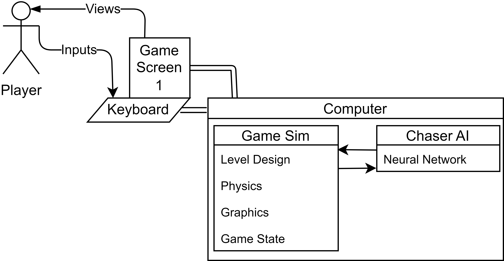

# Design Diagrams

### Design D0:

- Views: the Player watches the Game Screen
- Inputs: the Player sends the computer inputs by typing on a keyboard
- Both the Game Screen and the Keyboard are connected to the computer

### Design D1:

- The Chaser AI receives input from the Game Sim about the current game state
- Using that information the Chaser AI make decisions and send their input back to the Game Sim

### Design D2:

- The Game Screen displays the Game Sim using the Game Sim graphics
- As time progresses The Game updates its Game State as it receives new input using the Level Design and Physics
- The Chaser AI passes information from the Game Sim's Game State to their Neural Networks that dictate their next move

