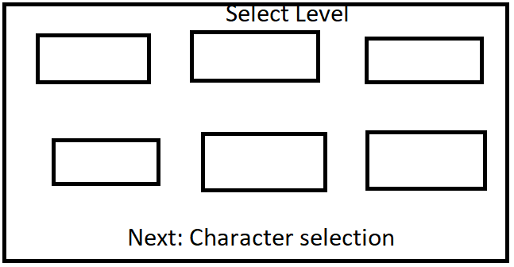

# User Docs: Getting Started

[Back](index.md)

### 1. Set Up Python Environment

Requirements: 

- Anaconda
- CUDA enabled GPU
- Windows OS, maybe Linux TODO

In the PythonServer directory found in the unity project contains all necessary files to run the Python server that is the AI backend for tag.AI. To set up the python environment for this game simply run `conda env create -f environment.yml` in the PythonServer directory. 

### 2. Start Python Server

Anytime the game is launched the python server must be running for gameplay to work. To start the python server, first activate the conda environment by running `conda activate tagAI`. Then run `python server.py`.

### 3. Starting a Game of Tag

Launch tag.AI from the executable.

Once the game is launched you will be met by the main menu.

To start a new game press "Play Game".

This will lead you to the level selection screen.

Click on the level you would like to play to select it the click "Next: Character selection".

This will bring you to the character selection screen.

Click on chaser or evader to select your role or click on spectator to watch two AI duke it out.

Click go to begin the game.

To control the game use the left right and up arrow key to control your character. Left and right will move your character left and right respectively. Pressing up will cause your character to jump. The up key can be held down a varying amount of time. Th longer it is held the higher your character will jump up to a point. 

 Once the game is finished you will be returned to the main menu.
